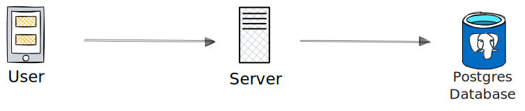

# 🔐 Spring Boot JWT Authentication

Hi there! 👋 I'm excited to share this project where I implement **JWT-based authentication** in a **Spring Boot** backend.  
This is a solid foundation for any application that requires **Spring Security** with user authentication and authorization using **PostgreSQL**. 🚀

## 🛠️ Technologies Used
- **Java 17**
- **Spring Boot 3**
- **Spring Security & JWT**
- **PostgreSQL**
- **JPA (Hibernate)**

## 📌 Features
✅ User registration and authentication.  
✅ Secure password hashing with BCrypt.  
✅ Endpoint protection using JWT.  
✅ Clean and modular configuration.

## 🏗️ Architecture
Here's an overview of the authentication flow with JWT in this project:



## 🚀 Getting Started

1️⃣ **Clone the repository**:
```bash
git clone https://github.com/lopezsDev/SecureAuthAPI.git
cd SecureAuthAPI

2️⃣ Set up environment variables:

Make sure to define the following environment variables before running the project:

export SPRING_DATASOURCE_URL=jdbc:postgresql://localhost:5432/your_db
export SPRING_DATASOURCE_USERNAME=your_user
export SPRING_DATASOURCE_PASSWORD=your_password
export JWT_SECRET=your_secret

3️⃣ Run the project:

./mvnw spring-boot:run

📩 Contact Me

[](mailto:lopezs.dev@gmail.com)
